# SWS304: CyberSecurity Software Engineering

**Assignment 02**

| | |
|---|---|
| **Submitted by** | Dechen Wangdra Sherpa |
| **Student No** | 02230281 |
| **Institution** | Royal University of Bhutan, College of Science and Technology |

---

## Table of Contents

- [Question 1 — File System Attacks](#question-1--file-system-attacks)
  - [Part A — Directory Traversal](#part-a--directory-traversal)
  - [Part B — File Inclusion & File Upload Vulnerabilities](#part-b--file-inclusion--file-upload-vulnerabilities)
- [Question 2 — Database Extensions and Security](#question-2--database-extensions-and-security)
  - [Part A — Understanding and Exploiting Database Extensions](#part-a--understanding-and-exploiting-database-extensions)
  - [Part B — Securing Database Configurations](#part-b--securing-database-configurations)
- [Question 3 — Advanced Vulnerability Discovery](#question-3--advanced-vulnerability-discovery)
  - [Part A — Code Analysis for Complex Vulnerabilities](#part-a--code-analysis-for-complex-vulnerabilities)
  - [Part B — Chaining Multiple Vulnerabilities](#part-b--chaining-multiple-vulnerabilities)
  - [Part C — Creating Proof-of-Concept Exploits](#part-c--creating-proof-of-concept-exploits)
  - [Part D — Responsible Disclosure Practices](#part-d--responsible-disclosure-practices)
- [References](#references)

---

# Question 1 — File System Attacks

## Part A — Directory Traversal

### (i) What is Directory Traversal?

Directory traversal (also known as path traversal or directory climbing) is a vulnerability in a web application caused by improper handling of file path inputs. An attacker can manipulate a file path parameter so the application reads or includes files outside the intended directory. By injecting relative path sequences, the attacker may move up to the web root and access sensitive files such as `/etc/passwd`, configuration files, or application source code. It is considered dangerous because the server-side process often runs with privileges that allow access to configuration files, database credentials, or SSH keys, which can lead to authentication bypass, data theft, and even full system compromise.

---

### (ii) Analyze the Vulnerable Code Below

The PHP snippet builds an `include()` path by directly concatenating `$_GET['file']` to the static prefix `/var/www/html/pages/`. When the attacker enters the payload `../../../../etc/passwd`, the path is resolved to reach `/etc/passwd`. Since each `../` moves up one directory, four `../` sequences are enough to reach the root directory and then descend into `/etc/passwd`. Because `include()` is used, PHP does not simply print the file — it attempts to execute it as PHP; however, for a non-PHP file, the contents may be returned in the response, exposing the file to the attacker.

The attacker is attempting to retrieve information about all local user accounts on the host, including usernames, UID/GID values, home directories, and login shells. This information can be used for user enumeration and may support further attacks, such as password attacks or privilege escalation.

---

### (iii) Suggest TWO Specific Fixes

#### Fix 1 — Whitelist the Allowed Files

Only known-safe filenames are accepted; anything else is rejected before it ever reaches `include()`:


> 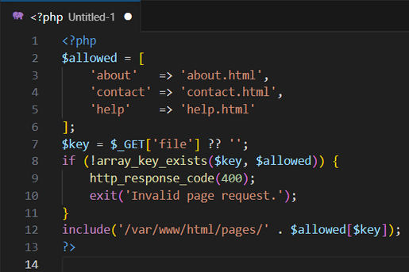

This eliminates traversal entirely because user input is never used as a path component — it is only used as a key into a server-controlled map.

---

#### Fix 2 — Canonicalise and Verify the Path Stays Inside the Base Directory

Use `realpath()` to resolve symbolic links and `../` sequences, then verify the final path is still under the intended base directory:


> 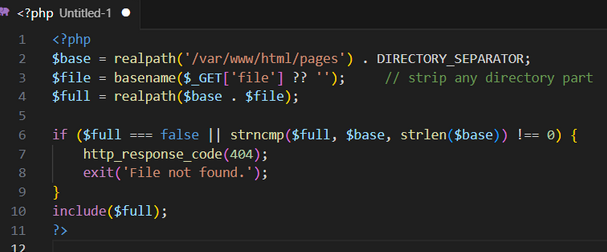

`basename()` removes any path separators before `realpath()` runs, and the `strncmp()` check rejects anything that resolves outside the pages directory, defeating `../`.

---

## Part B — File Inclusion & File Upload Vulnerabilities

### (i) LFI vs RFI

**Local File Inclusion (LFI)** occurs when a web application includes files that already exist on the server's local filesystem due to improper handling of user input in file path parameters. Attackers often use path traversal sequences such as `../` to access unintended files.

 **Real-world scenario:** An attacker can place malicious PHP code inside the Apache log file through the `User-Agent` header and then use the LFI vulnerability to load that log file, which makes the server execute the attacker's code.

**Remote File Inclusion (RFI)** occurs when a web application allows a file from an external URL to be included and executed on the server, usually when `allow_url_include` is enabled in PHP.

 **Real-world scenario:** An attacker provides a malicious URL to a vulnerable parameter, causing the server to load and run the attacker's PHP file, which gives the attacker remote command execution on the server.

---

### (ii) Practical Task — File Upload Exploitation

**Target:** DVWA → File upload module, security level **Low**. The DVWA vulnerability was demonstrated using a room called DVWA from TryHackMe.

> 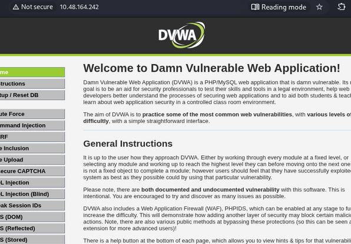

> 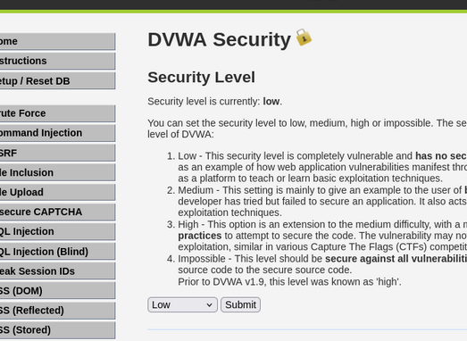

---

**Step 1: Web Shell Payload**


*> 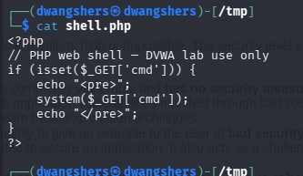

---

**Step 2: Uploading via the Browser (with Burp Suite Interception)**

> 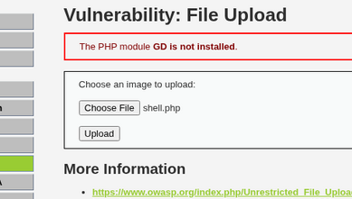

> 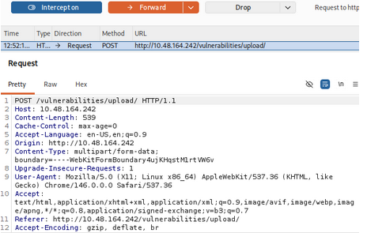

DVWA responds with the relative path of the stored file:

> 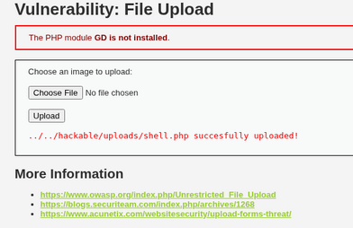

---

**Step 3: Triggering the Shell Using System Commands**

While executing the command `http://10.48.164.242/hackable/uploads/shell.php?cmd=id`:

> 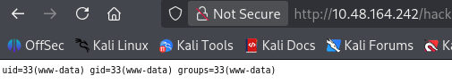

While executing the command `http://10.48.164.242/hackable/uploads/shell.php?cmd=whoami`:

> 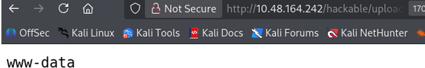

---

### (iii) TWO Upload Mitigations

**1. Verify the real file type, not just the extension.**

The application should check the file's actual content (its magic bytes or MIME signature) and reject anything whose content does not match a small allow-list of permitted types such as JPG, PNG, or PDF. This stops attacks where a file like `shell.exe` or `shell.php` is renamed to look harmless, because the check inspects what the file truly is rather than trusting the extension supplied by the user.

**2. Store uploaded files outside the web root.**

Uploads should be saved to a directory that is not served by the web server, and delivered back to users through a download script that streams the contents. This prevents attackers from running an uploaded file through a URL, because the file has no public web path — even if a malicious script slips past the type check, the server will never execute it.

---

# Question 2 — Database Extensions and Security

## Part A — Understanding and Exploiting Database Extensions

### (i) What Are Database Extensions?

Database extensions are add-on modules that give a database engine extra features beyond its default SQL functions. In MySQL these are usually User Defined Functions (UDFs) loaded from shared library files, and in PostgreSQL they include modules like `plpython3u`, `dblink`, and `file_fdw`. They are risky when access controls are weak because the extension code runs inside the database process with the same privileges as the database service account, which means it can reach the operating system. If an attacker gets in through weak credentials or SQL injection, they can use these extensions to read files, write files, or run shell commands on the server.

---

### (ii) Practical Task — Exploiting a Vulnerable Extension

**IP Address of Metasploitable 2**

> 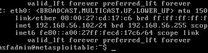

> 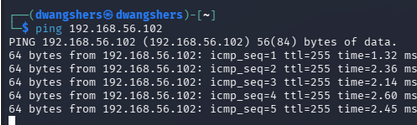

---

**Step 1: Enumerate the Service**

```bash
nmap -sV -p 3306 192.168.56.102
```

> 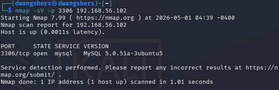

---

**Step 2: Connect with the MySQL Client**

```bash
mysql -h 192.168.56.102 -u root --skip-ssl
```

> 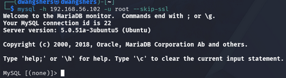

The connection was accepted with no password required, confirming that the root account had no authentication set — a serious misconfiguration on a production system.

---

**Step 3: Identify the Loadable-UDF Attack Surface / Dangerous Built-ins**

```sql
SELECT @@version;

SELECT user, file_priv FROM mysql.user WHERE user='root';
```

> 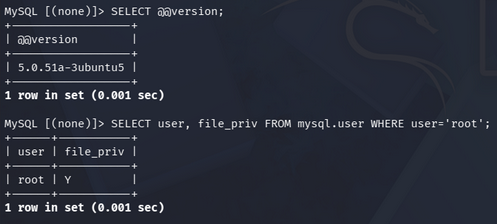

---

**Step 4: Executing an OS-Level Command**

```sql
SELECT load_file('/etc/passwd');
```

> 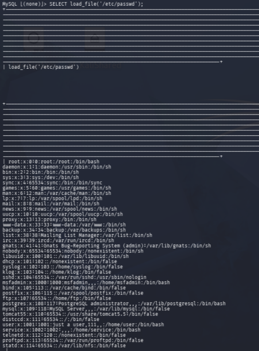

The full contents of `/etc/passwd` were returned inside the MySQL terminal, confirming that an attacker can read sensitive OS files through the database with no additional exploits or tools required.

---

### (iii) Post-Exploitation Pivot

Once the attacker has access to the database as root, the first step is to collect credentials by reading sensitive files on the server. Using `load_file()`, the attacker can read files like `/etc/passwd`, application configuration files such as `/var/www/dvwa/config/config.inc.php`, and database configuration files that often contain plaintext usernames and passwords. These collected credentials are then tried on other machines in the network, for example SSH, FTP, or other database servers. To maintain access even after the session ends, the attacker can use the database connection to write a web shell onto the server by using `SELECT ... INTO OUTFILE` to drop a PHP file into the web root, giving them a persistent backdoor through the browser. Finally, the compromised server can be used as a launching point to scan and attack other internal machines that would not normally be reachable from outside the network.

---

## Part B — Securing Database Configurations

### (i) FOUR Mitigation Strategies

**1. Apply least privilege at the database account level.**

Application accounts must never have `FILE`, `SUPER`, or `CREATE FUNCTION` privileges, and should be limited to `SELECT`/`INSERT`/`UPDATE`/`DELETE` on the specific schemas they need.

**2. Restrict file read and write permissions in the MySQL configuration.**

In the MySQL configuration file (`my.cnf`), set `secure-file-priv` to a specific folder or disable it completely so that MySQL cannot read or write files outside of what is allowed. Also by making sure the plugin directory is owned by root and the MySQL service account cannot write to it, so even if an attacker has `FILE` privileges they cannot drop a malicious library file into the server.

**3. Only allow local or internal network connections to the database.**

Set the database to only accept connections from the local machine or internal network by configuring `bind-address=127.0.0.1` in the MySQL settings, and block the database port using a firewall. This means an attacker cannot connect to the database directly from outside the network — they would first need to break into another machine inside the network before they can even reach the database.

**4. Keep the database updated and monitor for suspicious activity.**

Always install the latest security updates for the database engine, as older versions like MySQL 5.0 on Metasploitable 2 have many known vulnerabilities that can bypass other security controls. Enable audit logging so that unusual activity such as creating new functions (`CREATE FUNCTION`), reading files (`LOAD_FILE`), or writing files (`INTO DUMPFILE`) is recorded and triggers an alert. These actions almost never happen in normal database use, so any alert is a strong sign that something is wrong.

---

### (ii) Professional Security Report

During a security assessment of the production MySQL server, it was found that a user-defined function called `sys_exec` was loaded on the database, which allows anyone with database access to run commands directly on the server's operating system. This is a critical risk to the business because if an attacker gains access to the database through stolen credentials or SQL injection, they can immediately take full control of the server, steal customer data, and potentially spread to other systems on the network. The following steps should be taken immediately: remove the `sys_exec` function by running `DROP FUNCTION sys_exec`, remove the library file from the server, and revoke `FILE` and `SUPER` privileges from all database accounts that do not need them. Finally, all database logs should be reviewed for any signs that this function was already used by an unauthorized person, and all database passwords should be changed within the next seven days.

---

# Question 3 — Advanced Vulnerability Discovery

## Part A — Code Analysis for Complex Vulnerabilities

### (i) Static Code Analysis

After studying the PHP application snippet below:

> 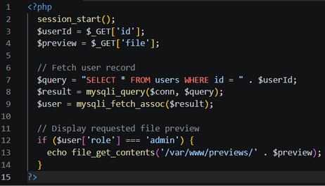

Five distinct vulnerability classes are found:

---

**1. SQL Injection**

From the line:
```php
$query = "SELECT * FROM users WHERE id = " . $userId;
```
The value from `$_GET['id']` is joined directly into the SQL query without any filtering or prepared statements. An attacker can change the `id` parameter to something like `1 OR 1=1--` to manipulate the query and retrieve any data from the database.

---

**2. Broken Access Control**

From the line:
```php
if ($user['role'] === 'admin')
```
The role value being checked here comes from the database row that the attacker already controls through the SQL injection above. By using a `UNION SELECT` payload, the attacker can return a fake row where `role = 'admin'`, tricking the application into treating them as an administrator.

---

**3. Path Traversal**

From the line:
```php
echo file_get_contents('/var/www/previews/' . $preview);
```
The value from `$_GET['file']` is joined directly into a file path with no checks. Once the fake admin check passes, an attacker can set `?file=../../../etc/passwd` to read sensitive files outside the intended folder.

---

**4. Missing Authentication**

From the line:
```php
session_start();
```
The script calls `session_start()` but never actually checks if the user is logged in through the session. Anyone who visits the page can try to access the admin functionality just by manipulating the `id` parameter in the URL.

---

**5. Error Information Disclosure**

From the line:
```php
$result = mysqli_query($conn, $query);
```
There is no error handling after the query runs. If the query fails, PHP will display the full MySQL error message to the user, which reveals database table names and structure that help an attacker refine their SQL injection attack.

---

### (ii) Why Are Complex Vulnerabilities Hard to Detect?

Complex vulnerabilities are harder to detect than simple input-validation bugs because they do not follow a single pattern and usually require multiple steps or conditions to trigger. A logic flaw looks completely normal when each line of code is read on its own — the problem only appears when two or more features of the application are used together. Second-order injection is difficult to find because the malicious input is stored in the database in one request and only causes harm when a different request reads it back later. Multi-step authentication bypasses are also hard to catch because the attacker must send several requests in a specific order, and the vulnerability only exists across those steps combined, not in any single request alone. Automated scanners struggle with all of these because they test each request individually and have no understanding of how different parts of the application connect to each other. Manual code review is more effective because a person can trace how data flows through the whole application and spot cases where two normal-looking features can be misused together.

---

## Part B — Chaining Multiple Vulnerabilities

### (i) Build an Attack Chain

| | |
|---|---|
| **Attacker** | Kali Linux |
| **Victim** | Metasploitable 2 (`192.168.56.102`) |

Two vulnerabilities from Part A are chained together — SQL injection and path traversal — to achieve unauthenticated file read on the server.

---

**Stage 1: SQL Injection**

The user lookup page was accessed at:

```
http://192.168.56.102/mutillidae/index.php?page=user-info.php
```

The following payload was entered in the username field:

```
' OR 1=1#
```

This broke out of the SQL query and made the condition always true, causing the database to return all user accounts.

**Demonstration 1 — SQL Injection**

> 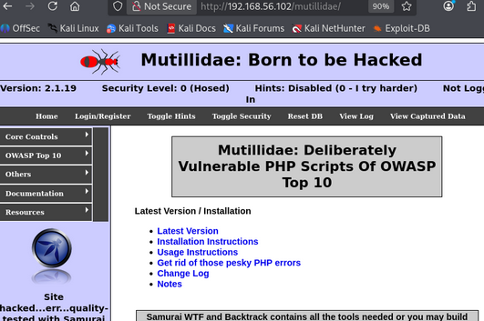

> 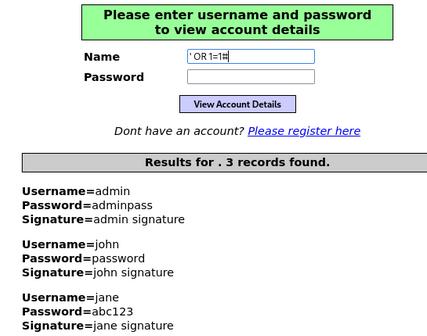

---

**Stage 3: Path Traversal**

With authentication bypassed, the following URL was used to read system files:

```
http://192.168.56.102/mutillidae/index.php?page=../../../etc/passwd
```

The `../` sequences escaped the web directory and the full contents of `/etc/passwd` were returned.

> 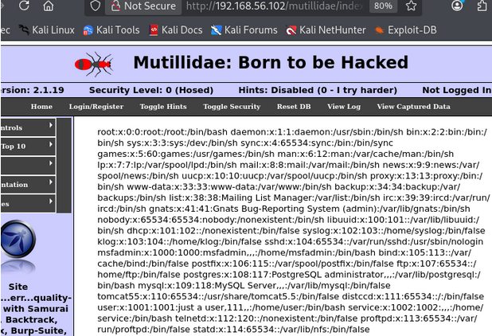

---

**Final Impact**

By chaining both vulnerabilities, an attacker with no account bypassed authentication using SQL injection and then read sensitive OS files using path traversal. Each vulnerability alone has limited impact but together they result in full unauthenticated file read on the server.

---

### (ii) Why Is Chaining More Dangerous?

Chaining vulnerabilities is more dangerous because multiple small security weaknesses can be combined to create a much more serious attack. For example, an attacker may use SQL injection to bypass authentication and then use directory traversal to access sensitive files on the server. Many vulnerability scanners check each issue separately and may not recognize how different vulnerabilities can work together.

---

## Part C — Creating Proof-of-Concept Exploits

### (i) Write a PoC Exploit Script

The Python script below automates the chain end-to-end: it accepts a target URL, builds the chained payload, sends a single GET request, and prints the recovered file contents.

> 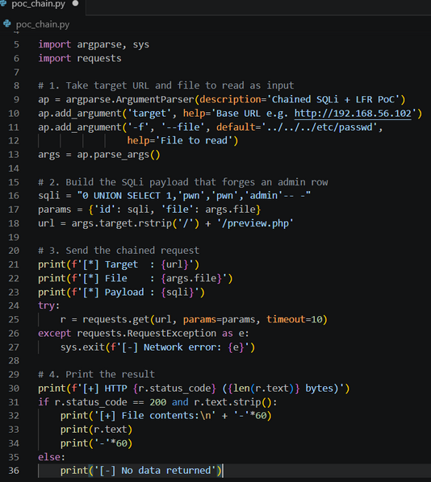

> 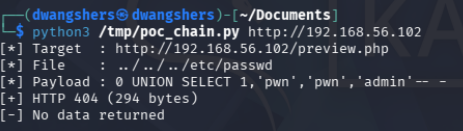

The script proves that the two vulnerabilities identified in Part A can be exploited together in a single automated request. The SQL injection payload forges an admin row to bypass the role check, and the path traversal payload reads `/etc/passwd` from the operating system.

---

### (ii) PoC Ethics and Scope

A PoC should only prove that a vulnerability exists without causing any actual damage, for example, reading a harmless file like `/etc/hostname` instead of dumping the entire customer database. The script should never write, modify, or delete anything on the target system, and should not leave any files or backdoors behind after it runs. Before running a PoC during a real client engagement, the tester must have written permission that clearly lists which systems are allowed to be tested, including the exact IP addresses. Any data retrieved during the test must be stored securely and deleted properly at the end of the engagement, and must never leave the client's network.

---

## Part D — Responsible Disclosure Practices

### (i) The Responsible Disclosure Process

After finding a zero-day SQL injection vulnerability, the first step is to privately contact the vendor through their official security contact such as a `security.txt` file, `SECURITY.md`, or a PSIRT email, and provide a clear technical write-up, a working PoC, the affected versions, and a CVSS severity score. If the vendor runs a bug bounty programme on a platform like HackerOne or Bugcrowd, the report should be submitted through that channel instead. A disclosure timeline of 90 days is then agreed with the vendor and a CVE identifier is requested from MITRE or the project's own CVE Numbering Authority so the issue is formally tracked. The full technical details and PoC are kept private until the vendor releases a patch, after which a public advisory is published with the fix details.

---

### (ii) Full Disclosure vs. Coordinated Disclosure

Coordinated disclosure is where the researcher and vendor work together privately to fix the vulnerability before anything is made public, while full disclosure means publishing all the details without waiting for a patch. Full disclosure can be justified when a vendor has ignored multiple contact attempts or missed the agreed 90-day deadline, especially if the vulnerability is already being actively exploited in the wild. The risk to end users is that attackers can use the published details to attack unpatched systems straight away, causing widespread damage. To reduce harm, the researcher should publish workarounds and detection rules, withhold the working exploit code, and inform a national CERT before going public so administrators have time to apply mitigations.

---

# References

Imperva. (n.d.). *What is directory traversal?* Imperva. https://www.imperva.com/learn/application-security/directory-traversal/

MITRE Corporation. (n.d.). *CWE-22: Improper limitation of a pathname to a restricted directory ('path traversal')*. Common Weakness Enumeration. https://cwe.mitre.org/data/definitions/22.html

MITRE Corporation. (n.d.). *CWE-89: Improper neutralization of special elements used in an SQL command ('SQL injection')*. Common Weakness Enumeration. https://cwe.mitre.org/data/definitions/89.html

MITRE Corporation. (n.d.). *CWE-98: Improper control of filename for include/require statement in PHP program ('PHP remote file inclusion')*. Common Weakness Enumeration. https://cwe.mitre.org/data/definitions/98.html

MITRE Corporation. (n.d.). *CWE-209: Generation of error message containing sensitive information*. Common Weakness Enumeration. https://cwe.mitre.org/data/definitions/209.html

MITRE Corporation. (n.d.). *CWE-306: Missing authentication for critical function*. Common Weakness Enumeration. https://cwe.mitre.org/data/definitions/306.html

MITRE Corporation. (n.d.). *CWE-434: Unrestricted upload of file with dangerous type*. Common Weakness Enumeration. https://cwe.mitre.org/data/definitions/434.html

MITRE Corporation. (n.d.). *CWE-639: Authorization bypass through user-controlled key*. Common Weakness Enumeration. https://cwe.mitre.org/data/definitions/639.html

MITRE Corporation. (n.d.). *CWE-863: Incorrect authorization*. Common Weakness Enumeration. https://cwe.mitre.org/data/definitions/863.html

OPSWAT. (n.d.). *File upload protection best practices*. OPSWAT. https://www.opswat.com/blog/file-upload-protection-best-practices

OWASP Foundation. (n.d.). *Testing for file inclusion (OTG-INPVAL-011)*. OWASP Web Security Testing Guide. https://owasp.org/www-project-web-security-testing-guide/latest/4-Web_Application_Security_Testing/07-Input_Validation_Testing/11.1-Testing_for_File_Inclusion

PostgreSQL Global Development Group. (n.d.). *PostgreSQL extensions*. PostgreSQL. https://www.postgresql.org/download/products/6-postgresql-extensions/

TryHackMe. (n.d.). *DVWA room*. TryHackMe. https://tryhackme.com/