# Assignment 04 — Prototype Pollution Vulnerabilities
**College of Science and Technology**

**Name: Dechen Wangdra Sherpa**

**Student No.: 02230281**

**Module: Advanced Web Attacks & Exploitation**

---

# Lab 1 — Client-Side Prototype Pollution via Browser APIs

---

## Walkthrough

### Step 1 — Explore the Application and Find the Vulnerable JS Code

Opening DevTools → Sources tab, the JavaScript on the page reads URL query parameters and assigns them to a config object. The vulnerable code uses something like `URLSearchParams` or a similar browser API to iterate over query keys and set them directly as properties on an object — without any sanitisation or key validation.

The key observation here is that the code also references `transport_url` from this config object, and uses it as the `src` for a script element — making it a **sink**. However, `transport_url` is defined on the config object using `Object.defineProperty()`, which locks the property directly on the object so it cannot be reassigned normally.

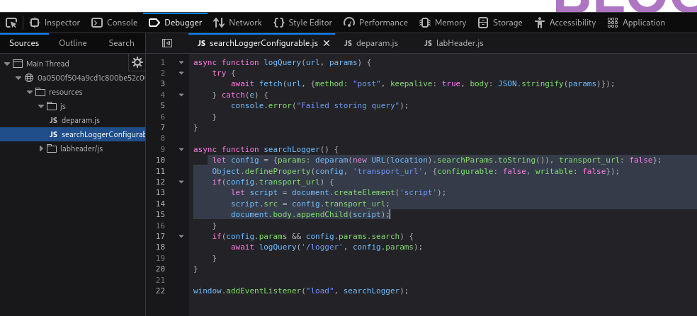
*Figure 1a: DevTools Sources — vulnerable JS reading URL parameters*

---

### Step 2 — Inject the Payload and Verify Pollution

The following payload was appended to the page URL to test whether `__proto__` is treated as a regular key:

```
?__proto__[testprop]=polluted
```

After reloading the page with this URL, the browser DevTools Console was opened and the following was typed:

```javascript
Object.prototype.testprop
```

The console returned `"polluted"`, confirming that the property was successfully written onto `Object.prototype` — not onto any individual object — and is now accessible from every object on the page.

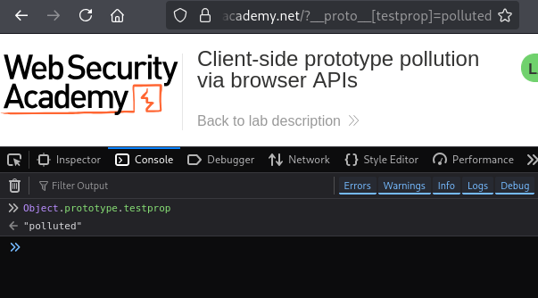
*Figure 1b: Console output — Object.prototype.testprop returns "polluted"*

---

### Step 3 — Identify the bypass via `Object.defineProperty()` and `value`

Since `transport_url` was already defined directly on the config object using `Object.defineProperty()` with **no `value` in the descriptor**, the property itself couldn't be overwritten. However, when JavaScript internally resolves the `value` during property access, it falls back up the prototype chain.

This means polluting `Object.prototype.value` would be read as the value for that descriptor — so the payload becomes:

```
?__proto__[value]=pollute
```

Tested this and confirmed it was picked up. Then escalated it to an actual XSS payload:

```
?__proto__[value]=data:,alert(1);
```

The page loaded the polluted `value` as the `transport_url` src, which executed `alert(1)`.

**Final payload URL:**

```
[https://LAB-ID.web-security-academy.net/?__proto__[value]=data:,alert(1)]
```

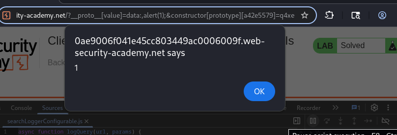
*Figure 1c: Lab 1 — Client-Side Prototype Pollution via Browser APIs — solved*

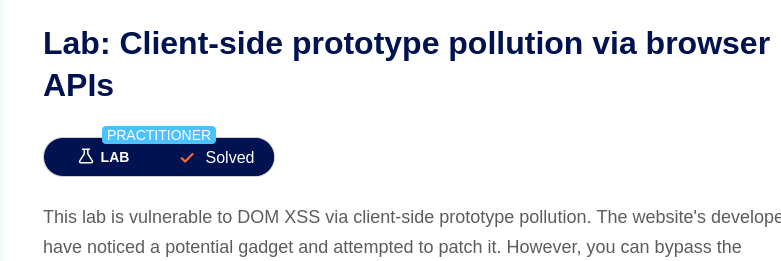
*Figure 1d: Lab 1 — PortSwigger lab solved confirmation banner*

---

## Summary

The lab exploited a client-side prototype pollution vulnerability where URL query parameters were assigned to an object without key sanitisation, allowing `Object.prototype` to be modified. Although `transport_url` was locked on the config object via `Object.defineProperty()`, the descriptor lacked an explicit `value` — so JavaScript's prototype chain lookup surfaced the polluted `Object.prototype.value` instead. By injecting `?__proto__[value]=data:,alert(1);`, the polluted value was used as a script source URL, triggering XSS. In a real-world scenario, this could allow an attacker to load arbitrary malicious scripts into any user's browser visiting the affected page.

---

## Questions — Lab 1

### Question 1.1

*Why does adding `?__proto__[x]=y` to the URL cause `Object.prototype` to be modified — and not just the single object created from the URL parameters?*

Looking at the `deparam` function, when it parses a key like `__proto__[testprop]`, it splits it into a keys array: `['__proto__', 'testprop']`. It then walks that path on the base object `obj` using bracket notation in this loop:

```javascript
cur = cur[key] = i < keys_last
    ? cur[key] || ( keys[i+1] && isNaN( keys[i+1] ) ? {} : [] )
    : val;
```

So it effectively does `obj['__proto__']['testprop'] = 'polluted'`. In JavaScript, `obj['__proto__']` does not return a regular property — it is a special accessor that points directly to `Object.prototype` itself. So the assignment lands on `Object.prototype.testprop`, not on `obj`. Since every object in JavaScript inherits from `Object.prototype` by default, the polluted property now appears on **all** objects in the application — not just `obj`. This is the core danger of prototype pollution: one write to `__proto__` propagates globally across the entire prototype chain.

### Question 1.2

*Name ONE defence a developer could add to the JavaScript code to prevent this attack.*

The most direct fix is to replace the base object in `deparam` with a **null-prototype object**:

```javascript
var obj = Object.create(null);
```

Instead of:

```javascript
var obj = {};
```

A regular `{}` object has `Object.prototype` as its prototype, which is exactly what `obj['__proto__']` reaches through. By creating the object with `Object.create(null)`, it has **no prototype at all** — so `obj['__proto__']` is just a plain string key with no special behaviour, and the assignment simply creates a harmless own property on `obj` named `__proto__` instead of touching `Object.prototype`. The pollution path is completely cut off.

---

# Lab 2 — DOM XSS via Client-Side Prototype Pollution

---

## Walkthrough

### Step 1 — Confirm prototype pollution is possible

Added the following to the URL to test whether the page was vulnerable to prototype pollution via query parameters:

```
/?__proto__[foo]=bar
```

Opened DevTools Console and ran `Object.prototype` — the output showed a `foo` property with the value `bar`, confirming that `Object.prototype` was being successfully polluted through the URL.

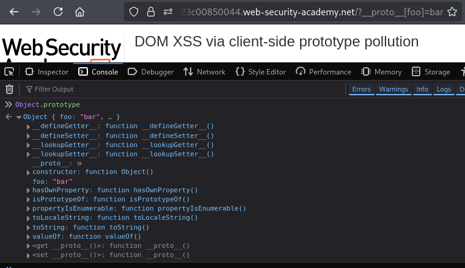
*Figure 2a: Console showing `Object.prototype` with `foo: "bar"` after the test payload*

---

### Step 2 — Find the source and the sink*

Browsing through the JavaScript files in DevTools Sources, inside `searchLogger.js` the following pattern was identified:

- The **source** — URL query parameters are parsed and assigned to a `config` object via `deparam()`, the same vulnerable function from Lab 1, which allows `__proto__` keys to reach `Object.prototype`
- The **sink** — the code reads `config.transport_url` and uses it as the `src` of a dynamically created `<script>` element, which is then appended to the DOM

This means any value injected into `Object.prototype.transport_url` would flow directly into the `script.src` — a classic DOM XSS sink.

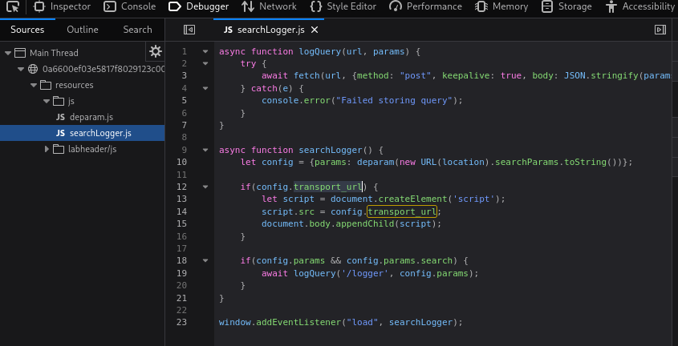
*Figure 2b: DevTools Sources — `searchLogger.js` showing `config.transport_url` being set as `script.src`*

**Sink property identified: `transport_url`**

---

### Step 3 — Verify the sink is reachable via pollution

Injected a test value for `transport_url` through the prototype:

```
/?__proto__[transport_url]=foo
```

Checked the Inspector panel — a `<script>` tag had been injected into the DOM with `src="foo"`. This confirmed the polluted value was travelling up the prototype chain and being read by the sink code, since `config.transport_url` was not defined as an own property on `config`, so JavaScript looked up the chain and found the polluted value on `Object.prototype`.

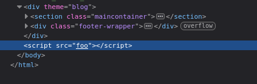
*Figure 2c: DevTools Elements panel showing `<script src="foo">` injected into the DOM*

---

**Step 4 — Escalate to XSS and solve the lab**

Replaced `foo` with a `data:` URL payload to trigger JavaScript execution:

```
/?__proto__[transport_url]=data:,alert(1);
```

The browser loaded the `data:` URL as the script source and executed `alert(1)`.

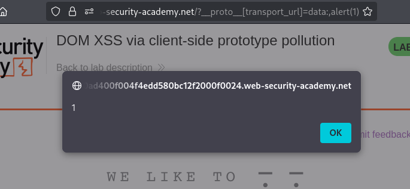
*Figure 2d: `alert(1)` dialog triggered in the browser*

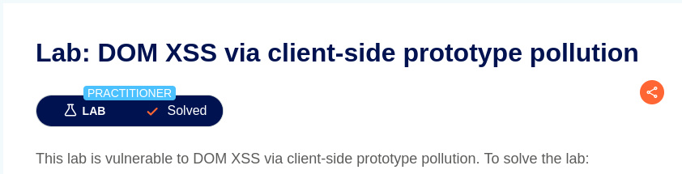
*Figure 2e: PortSwigger lab solved confirmation banner*

---

## Summary

The attack worked in two stages. First, the `deparam()` function parsed the URL query string and — because it uses bracket notation to walk key paths — allowed `?__proto__[transport_url]=...` to write directly onto `Object.prototype`. Second, `searchLogger.js` read `config.transport_url` to use as a script source; since `transport_url` was not defined as an own property on `config`, JavaScript's prototype chain lookup reached up to `Object.prototype` and returned the injected value. This connected the pollution source to the DOM sink without any direct interaction with the sink code. By injecting a `data:` URL, arbitrary JavaScript was executed in the victim's browser — a real-world attacker could use this to steal session cookies, perform actions on behalf of the user, or load a full malicious script from an external server.

---

## Questions — Lab 2

### Question 2.1

*Why would injecting the XSS payload directly into the sink without prototype pollution NOT work in this lab?*

The sink reads its value from `config.transport_url`. There is no user-controlled input that directly sets `config.transport_url` — there is no URL parameter named `transport_url` that the code reads and assigns there explicitly. The only way user input reaches `config` is through `deparam()`, which builds the config object from query parameters. If you simply added `?transport_url=data:,alert(1)` to the URL, `deparam()` would set `obj.transport_url` on the plain parsed object — but that object is assigned to `config.params`, not merged into `config` itself. So `config.transport_url` would remain `false` as initialised, and the sink would never fire. Prototype pollution is the bridge — it bypasses the normal data flow by injecting the value onto `Object.prototype` so that when `config.transport_url` is looked up and found absent as an own property, JavaScript walks the chain and finds the attacker's value there instead.

### Question 2.2

*A developer adds DOMPurify to sanitise all `innerHTML` assignments. Does this fully fix the vulnerability?*

No, this does not fix it at all in this case. The sink here is `script.src`, not `innerHTML`. DOMPurify is designed to sanitise HTML strings before they are written into the DOM via `innerHTML` or similar — it has no effect on `script.src` assignments. An attacker can still inject a `data:` URL directly as the script source and execute arbitrary JavaScript without touching `innerHTML` at all. Two things need to be fixed: first, the **pollution source** — `deparam()` needs to be patched, either by using `Object.create(null)` as the base object so `__proto__` has no special meaning, or by explicitly blocking `__proto__` as a key. Second, the **sink** itself needs hardening — the code should validate that `transport_url` is a trusted value, for example by checking it against an allowlist of safe URL schemes before using it as a script source. Sanitising `innerHTML` alone leaves both the source and the actual sink completely unprotected.

---
---

# Lab 3 — Privilege Escalation via Server-Side Prototype Pollution

---

## Walkthrough

### Step 1 — Intercept the JSON Request in Burp Suite

After logging in with the provided regular-user credentials, an endpoint that accepts a JSON body was located (typically a profile or address update form). Burp Suite was used to intercept the POST request before it reached the server.

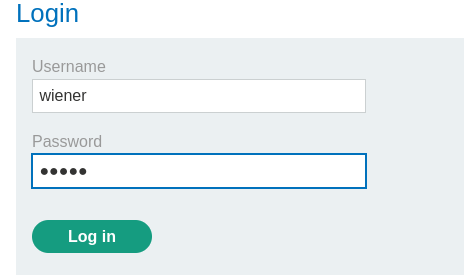

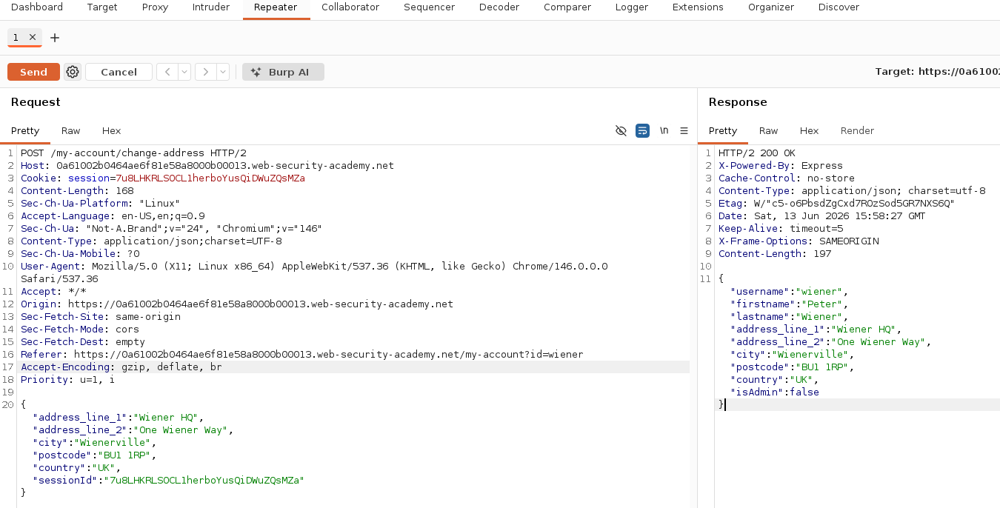
*Figure 3a: Burp Suite — JSON request send to repeater*

---

### Step 2 — Inject the `__proto__` Payload

The JSON body was modified in Burp Suite's Intercept panel to include a `__proto__` key at the top level of the JSON object. This instructs the server-side merge function to walk into `Object.prototype` and set `isAdmin: true` on it:

```json
{
    "__proto__": {
        "isAdmin": true
    }
}
```

When a vulnerable server-side `merge()` or `extend()` function processes this JSON, it iterates over all keys — including `__proto__` — and performs `target["__proto__"]["isAdmin"] = true`. As on the client side, this does not create a key called `__proto__` on the target object; it navigates to `Object.prototype` and sets `isAdmin` there. Because Node.js runs as a single shared JavaScript process, this polluted `Object.prototype` now affects every object created in the process — including objects representing other users' sessions.

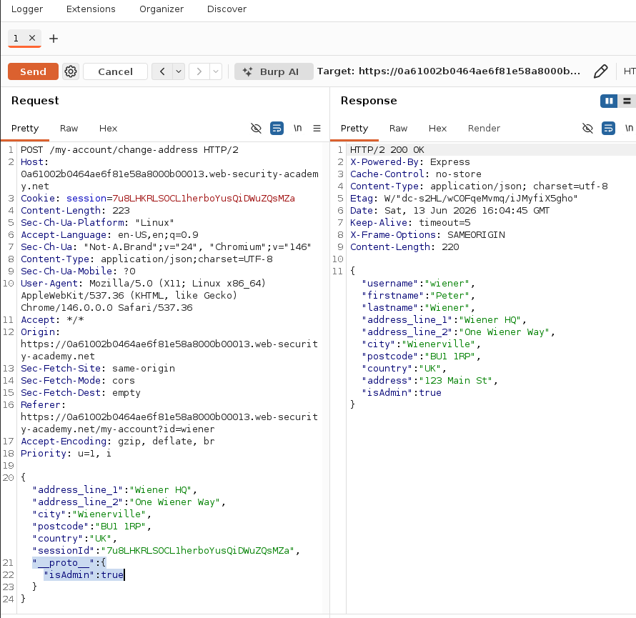
*Figure 3b: Burp Suite — __proto__ payload added to JSON body and Server response confirming payload accepted*

---

### Step 3 — Solve the Lab

With `Object.prototype.isAdmin` now set to `true` on the server, any server-side check of the form `if (user.isAdmin)` returns `true` for all users — because the property is inherited from the polluted prototype rather than being explicitly set. Admin functionality (such as deleting users or accessing an admin panel) became accessible, and the required admin action was completed to solve the lab.

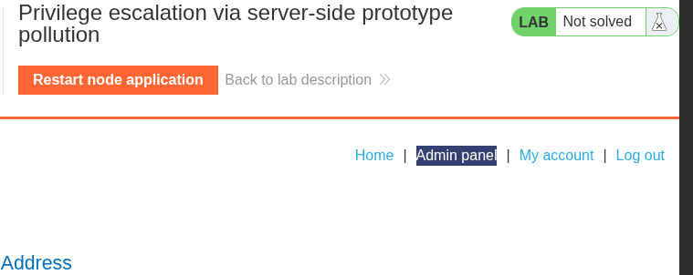
*Figure 3c: Admin-panal now accessible*


*Figure 3d: Lab 3 — Admin-panal Page accessed*


*Figure 3e: Lab 3 — PortSwigger lab solved confirmation banner*

---

## Summary

This lab demonstrated **server-side prototype pollution leading to privilege escalation in a Node.js application**. When the server received the JSON body, a vulnerable `merge()` function iterated over all keys including `__proto__`, causing `isAdmin: true` to be written onto the server's `Object.prototype`. Because Node.js runs a single shared JavaScript runtime for all requests in the process, this pollution immediately affected every object in the application — including objects used to check user permissions for other users' requests. Any code that checks `user.isAdmin` now returns `true` even for accounts that were never granted admin rights, because the property is inherited from the globally polluted `Object.prototype` rather than being explicitly set on the user object. This is a critical distinction from client-side pollution: the effect persists across all subsequent requests until the server process is restarted.

---

## Questions — Lab 3

### Question 3.1

After sending the `__proto__` payload once, the pollution persists for all objects in the Node.js process because **Node.js runs a single JavaScript runtime (V8 engine instance) that is shared across all incoming requests**. There is only one `Object.prototype` in that runtime, and it is the root of the prototype chain for every ordinary object created anywhere in the application. When the merge function set `Object.prototype.isAdmin = true`, it modified this single shared root object. Every subsequent `{}` object literal, every `new SomeClass()`, and every object created for any incoming request — regardless of which user sent it — inherits from that same `Object.prototype`. So when code for User B's request checks `userObject.isAdmin`, JavaScript looks up the prototype chain: `userObject → UserB's prototype → Object.prototype`, and finds `isAdmin: true` there. The attacker's single write to `Object.prototype` propagates silently to all objects in the entire process, across all users and all requests, until the Node.js process is restarted and a fresh `Object.prototype` is created.

### Question 3.2

The correct fix is to **block the `__proto__` and `constructor` keys explicitly inside the merge function**, or better, to use a safe merge implementation that never assigns to special keys:

```javascript
// Vulnerable merge
function merge(target, source) {
    for (const key in source) {
        target[key] = source[key];  // __proto__ reaches Object.prototype
    }
}

// Fixed merge — blocklist approach
function merge(target, source) {
    for (const key in source) {
        if (key === "__proto__" || key === "constructor" || key === "prototype") {
            continue;  // Skip dangerous keys entirely
        }
        if (typeof source[key] === "object" && source[key] !== null) {
            if (!target[key]) target[key] = {};
            merge(target[key], source[key]);  // Recurse safely
        } else {
            target[key] = source[key];
        }
    }
}
```

The most robust alternative is to use `Object.assign()` with an `Object.create(null)` target, or to use the `structuredClone()` built-in (Node.js 17+) which does not transfer prototype chains. Using `JSON.parse(JSON.stringify(source))` as a sanitisation step before merging also strips `__proto__` because `JSON.stringify` skips non-serialisable prototype references. Libraries such as **lodash** (v4.17.21+) have patched their `merge` functions to block these keys — using a well-maintained library is preferable to implementing a custom merge.

---
---

# Lab 4 — Bypassing Flawed Input Filters for Server-Side Prototype Pollution

---

## Walkthrough

### Step 1 — Confirm `__proto__` is Blocked

The same `__proto__` payload used in Lab 3 was attempted first. The server detected the `__proto__` key and rejected the request.

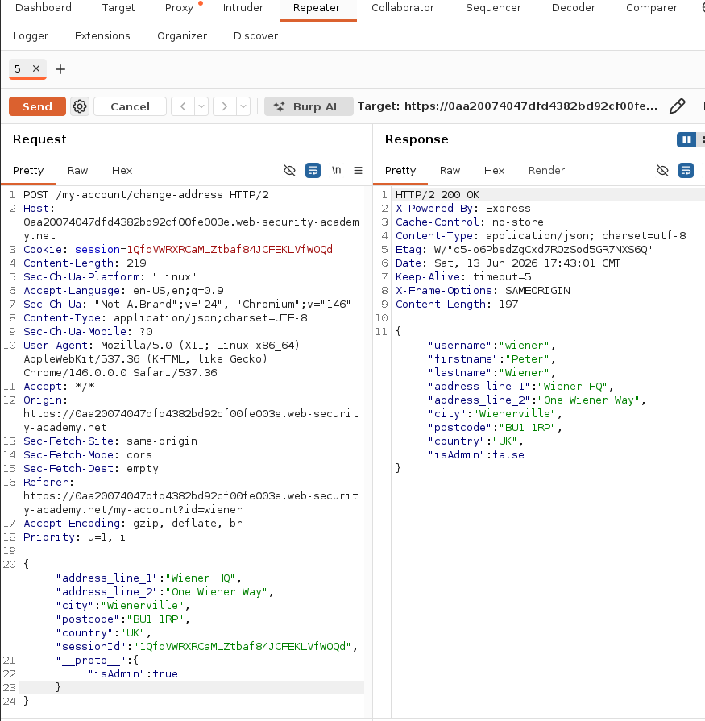
*Figure 4a: Server blocks __proto__ — filter confirmed active*

---

### Step 2 — Use the `constructor.prototype` Bypass

Because `__proto__` is blocked, the alternative path through `constructor.prototype` was used instead. Every JavaScript object has a `.constructor` property pointing to the function that created it — for plain objects, this is `Object`. And `Object.constructor.prototype` is exactly `Object.prototype`. So the path `constructor → prototype` reaches the same destination as `__proto__`, but uses a completely different key name that the simple filter does not check for:

```json
{
    "constructor": {
        "prototype": {
            "isAdmin": true
        }
    }
}
```

When the vulnerable merge function processes this, it recurses into the `constructor` key (a real property on all objects), then into `prototype` (which on `Object` is `Object.prototype`), and sets `isAdmin: true` — achieving exactly the same pollution as `__proto__`, through a path the filter ignores.

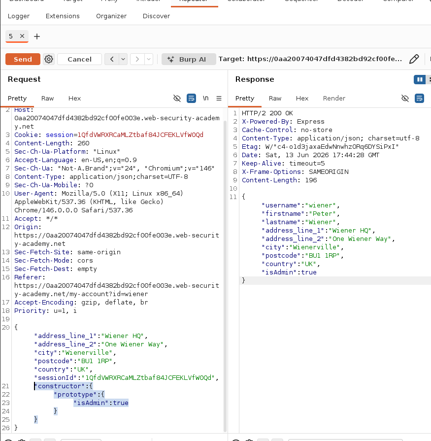
*Figure 4b: Server response — constructor.prototype bypass payload injected and constructor.prototype bypass accepted*

---

### Step 3 — Solve the Lab

With `Object.prototype.isAdmin` now set via the bypass path, admin privileges were obtained identically to Lab 3. The required admin action was performed to solve the lab.

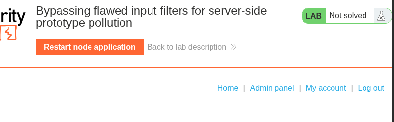
*Figure 4c: Lab 4 — Admin-panal accessiable*

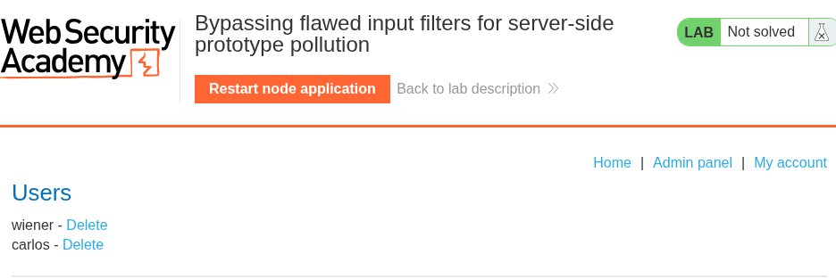
*Figure 4d: Lab 4 — Admin-panal accessed*


*Figure 4e: Lab 4 — Bypassing Flawed Input Filters — solved*

---

## Summary

This lab demonstrated that a **blocklist-only filter is an insufficient defence against prototype pollution**. The server blocked the `__proto__` key by name but did not account for the alternative path `constructor.prototype`, which reaches the identical `Object.prototype` destination through a different traversal of the prototype chain. Because the filter checked only for the string `"__proto__"`, the bypass worked by simply using `constructor` as the top-level key and `prototype` as its nested key — both of which are ordinary-sounding property names that the filter allowed through. The root cause is that blocklist approaches are inherently fragile: they require the developer to anticipate every possible dangerous path, whereas an attacker needs to find only one that was missed. A robust fix — disabling recursive key merging entirely, or using a structural approach like `Object.create(null)` — would have blocked both paths simultaneously without needing to enumerate them.

---

## Questions — Lab 4

### Question 4.1

The path `constructor.prototype` reaches `Object.prototype` because of how JavaScript's object model is structured. Every object in JavaScript has two relevant built-in links:

1. `obj.__proto__` — the object's direct prototype (for a plain `{}` object, this is `Object.prototype`)
2. `obj.constructor` — a reference to the **function** that created the object (for a plain `{}` object, this is the built-in `Object` function)

The `Object` function — like all functions in JavaScript — has a `.prototype` property, and that property **is** `Object.prototype`. So the chain resolves as:

```
anyPlainObject.constructor     → Object (the constructor function)
Object.prototype               → Object.prototype (the shared root object)
```

Therefore:
```javascript
anyPlainObject.constructor.prototype === Object.prototype  // true
anyPlainObject.__proto__             === Object.prototype  // true
```

Both paths arrive at exactly the same object. The prototype chain diagram from Chapter 6 shows `Object.prototype` sitting at the root of all ordinary objects. Whether you navigate there via the `__proto__` shortcut or via the `constructor.prototype` property chain, you land on the same root — and a write there pollutes every ordinary object in the runtime. A simple filter that only blocks the string `"__proto__"` leaves the `constructor.prototype` route completely open.

### Question 4.2

Blocking `constructor` in addition to `__proto__` is **not a complete protection**. The application would still be vulnerable through other bypass techniques — for example, deeply nested `__proto__` paths, Unicode escapes for key names, or future JavaScript engine quirks. Blocklist approaches are fundamentally fragile because they require a developer to predict every dangerous path, while an attacker needs only one missed case.

A truly robust fix must be **structural, not lexical**:

**Option 1 — Use `Object.create(null)` for merge targets.** If the target object has no prototype, there is nothing to pollute. The `constructor` and `__proto__` properties have no special meaning on a null-prototype object.

**Option 2 — Use `hasOwnProperty` guard and freeze `Object.prototype`.**
```javascript
Object.freeze(Object.prototype);  // Prevents any writes to Object.prototype at runtime
```
Freezing `Object.prototype` means any attempt to write `isAdmin` (or any other property) to it will silently fail (or throw in strict mode), regardless of the path used — `__proto__`, `constructor.prototype`, or any other route.

**Option 3 — Replace recursive merge with `structuredClone()` or `JSON.parse(JSON.stringify(input))`.** These approaches serialise and deserialise the data, stripping all prototype references and dangerous keys in the process.

**Option 4 — Schema validation before merge.** Use a strict JSON schema validator (e.g., `ajv`) to reject any input object that contains keys not explicitly whitelisted. This is the most architecturally sound approach: instead of blocking known-bad keys, only allow known-good ones.

The correct answer is to adopt one of these structural fixes — ideally `Object.freeze(Object.prototype)` combined with schema validation — rather than extending a blocklist that will always have gaps.

---